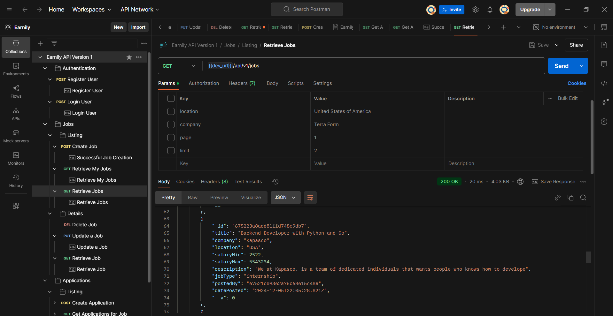

# EARNILY

## A simple and easy to use api for setting up a simple job board.

### Features

- Create a job
- Get all jobs
- Get a single job
- Update a job
- Delete a job

### How to use

- Clone the repository
- Run `npm install`
- Run `npm start`

### Endpoints

- POST `/api/v1/register` - Register a user
- POST `/api/v1/login` - Login a user
- POST `/api/vi/jobs` - Create a job

### Technologies

- Node.js
- Express
- MongoDB

### Author

- [Eze Israel John](https://ezeisraeljohn.me)

### License

- MIT
