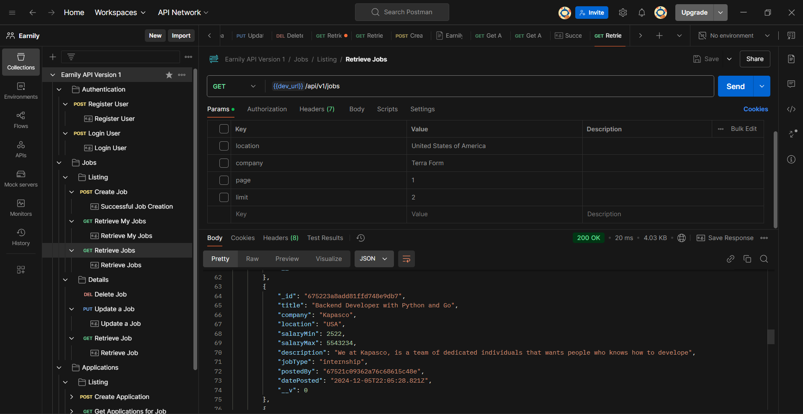

# Earnily API



Earnily is a robust API for building job-seeking and employment platforms. It provides endpoints for user authentication, job postings, applications, company management, reviews, and more. Built with Node.js, Express, and MongoDB, it supports modern workflows for both employers and jobseekers.

---

## Table of Contents

1. [Features](#features)
2. [Getting Started](#getting-started)
3. [Environment Variables](#environment-variables)
4. [API Endpoints](#api-endpoints)
5. [Technologies Used](#technologies-used)
6. [Testing](#testing)
7. [API Documentation](#api-documentation)
8. [Contributing](#contributing)
9. [Author](#author)
10. [License](#license)

---

## Features

- User registration, login, and authentication (JWT)
- Email verification and password reset via OTP
- Employer and jobseeker roles
- Company creation and management
- Job posting, updating, and deletion (employers)
- Job search and filtering
- Job application with resume and attachments (jobseekers)
- Application status updates (employers)
- Skill and category management
- Company, job, and user reviews
- File uploads to Azure Blob Storage
- Rate limiting and security best practices

---

## Getting Started

### Prerequisites

- [Node.js](https://nodejs.org/) (v14+ recommended)
- [MongoDB](https://www.mongodb.com/)
- [npm](https://www.npmjs.com/)
- Azure Blob Storage account (for file uploads)

### Installation

1. **Clone the repository:**

   ```bash
   git clone https://github.com/ezeisraeljohn/earnily.git
   cd earnily
   ```

2. **Install dependencies:**

   ```bash
   npm install
   ```

3. **Set up environment variables:**  
   Create a `.env` file in the root directory and add the required variables (see [Environment Variables](#environment-variables)).

4. **Start the server:**

   ```bash
   npm start
   ```

   The server will run on `http://localhost:3000` by default.

---

## Environment Variables

Create a `.env` file in the root directory and configure the following:

```env
SECRET=your_jwt_secret
PORT=3000
Test_MONGO_URI=mongodb://localhost:27017/earnily
T_Mongo_URI=mongodb://localhost:27017/test_earnily
AZURE_STORAGE_CONNECTION_STRING=your_azure_blob_connection_string
IPINFO_URL=https://ipinfo.io
IPINFO_TOKEN=your_ipinfo_token
EARNILY_LOGO_URL=https://yourdomain.com/logo.png
```

---

## API Endpoints

Below is a summary of the main endpoints. For full details, see [API Documentation](#api-documentation).

### Authentication

- `POST /api/v1/register` — Register a new user
- `POST /api/v1/login` — Login and receive a JWT
- `POST /api/v1/verify-email` — Verify user email with OTP
- `POST /api/v1/resend-otp` — Resend email verification OTP
- `POST /api/v1/password-reset` — Request password reset OTP
- `POST /api/v1/password-reset/verify` — Verify password reset OTP
- `POST /api/v1/password-reset/complete` — Complete password reset

### Users

- `GET /api/v1/user/:userId` — Get user profile
- `PUT /api/v1/user/:userId` — Update user profile
- `DELETE /api/v1/user/:userId` — Delete user

### Companies

- `POST /api/v1/company` — Create a company (employer only)
- `GET /api/v1/company/:companyId` — Get company details
- `PUT /api/v1/company/:companyId` — Update company
- `DELETE /api/v1/company/:companyId` — Delete company

### Jobs

- `POST /api/v1/jobs` — Create a job (employer only)
- `GET /api/v1/jobs` — List all jobs (with filters)
- `GET /api/v1/jobs/:id` — Get job by ID
- `PUT /api/v1/jobs/:id` — Update a job (employer only)
- `DELETE /api/v1/jobs/:id` — Delete a job (employer only)
- `GET /api/v1/jobs/me` — List jobs posted by the authenticated employer

### Applications

- `POST /api/v1/job/:jobId/apply` — Apply for a job (jobseeker only)
- `GET /api/v1/job/:jobId/applications` — Get applications for a job (employer only)
- `GET /api/v1/applications` — Get applications submitted by the user (jobseeker only)
- `PUT /api/v1/applications/:id` — Update application status (employer only)

### Reviews

- `POST /api/v1/jobs/:jobId/reviews` — Review a job (jobseeker only)
- `GET /api/v1/jobs/:jobId/reviews` — Get all reviews for a job
- `POST /api/v1/company/:companyId/reviews` — Review a company (jobseeker only)
- `GET /api/v1/company/:companyId/reviews` — Get all reviews for a company
- `POST /api/v1/user/:userId/reviews` — Review a user (employer only)

### Skills & Categories

- `GET /api/v1/skills` — List all skills
- `GET /api/v1/job-categories` — List all job categories

---

## Technologies Used

- Node.js & Express.js
- MongoDB & Mongoose
- Azure Blob Storage (file uploads)
- JWT Authentication
- bcrypt (password hashing)
- CORS, rate limiting, and security middleware
- Jest & Supertest (testing)

---

## Testing

To run the test suite:

```bash
npm test
```

Tests cover authentication, job posting, applications, and more.

---

## API Documentation

Interactive API documentation is available via Postman:

[](https://documenter.getpostman.com/view/38873322/2sAYBbdoiw)

Or view the [full API documentation here](https://documenter.getpostman.com/view/38873322/2sAYBbdoiw).

---

## Contributing

Contributions are welcome! Please fork the repository and submit a pull request.

---

## Author

- [Eze Israel John](https://ezeisraeljohn.me)

---

## License

This project is licensed under the MIT License. See the [LICENSE](LICENSE) file for details.
